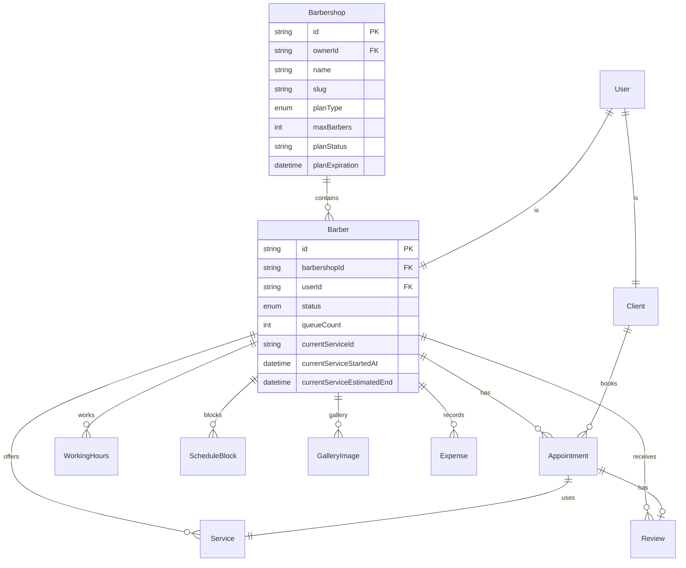
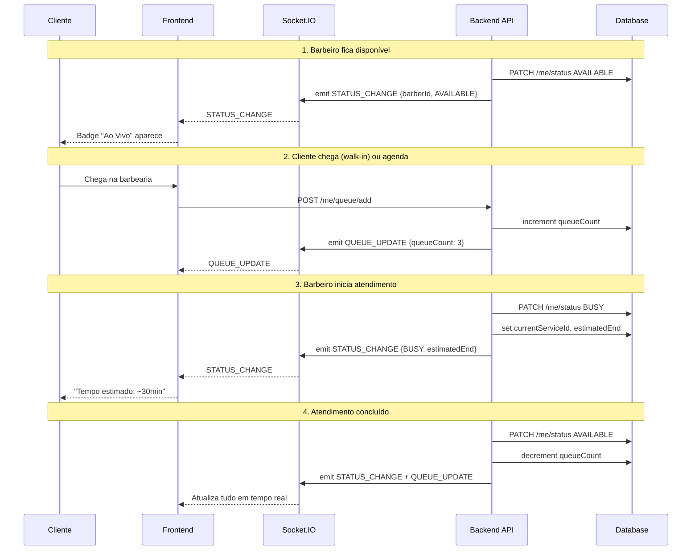

# Plano de Implementação: BarberFlow Hybrid SaaS

## Análise de Gap: Código Atual vs Especificação Técnica

### 📊 O que já existe (e será reaproveitado)

| Componente | Status | Observação |
|-----------|--------|------------|
| Modelo `Barber` com `planType`/`planStatus`/`maxStaff`/`ownerId` | ✅ Existe | Precisa ser refatorado para o novo modelo `Barbershop` |
| Auto-relacionamento `Barber` → `staff` | ✅ Existe | Será movido para `Barbershop` → `Barber` |
| Rota `GET /api/subscriptions/plans` | ✅ Existe | Precisa ser atualizada com novos planos (ESSENTIAL/PRO/ELITE) |
| Rota `POST /api/subscriptions/subscribe` | ✅ Existe | Precisa ser atualizada |
| Rota `POST /api/subscriptions/staff` | ✅ Existe | Precisa ser atualizada |
| Socket.IO (`socketLoader`) | ✅ Existe | Precisa ser refatorado para salas por barbearia |
| `SchedulingService.getAvailableSlots()` | ✅ Existe | Precisa de ETC (Estimated Time Completion) |
| Dashboard do barbeiro | ✅ Existe | Precisa de widgets de status e fila |
| Perfil público (`BarberHero`, `BarberInfo`) | ✅ Existe | Precisa de Live Badge e tempo médio |

### 🆕 O que precisa ser criado/modificado

---

## FASE 1: Infraestrutura de Dados (Banco de Dados)

### 1.1 Schema Prisma — Novo modelo `Barbershop`

**Arquivo:** [`backend/prisma/schema.prisma`](backend/prisma/schema.prisma:1)

**Mudanças:**
1. Adicionar `enum PlanType { ESSENTIAL PRO ELITE }`
2. Adicionar `enum BarberStatus { AVAILABLE BUSY BREAK OFFLINE }`
3. Criar modelo `Barbershop`:
   - `id String @id @default(uuid())`
   - `ownerId String @unique` (referência ao User dono)
   - `name String`
   - `slug String @unique`
   - `plan PlanType @default(ESSENTIAL)`
   - `maxBarbers Int @default(1)` (ESSENTIAL=1, PRO=5, ELITE=15)
   - `planStatus String @default("TRIAL")`
   - `planExpiration DateTime?`
   - `createdAt DateTime @default(now())`
   - `barbers Barber[]`
4. Modificar modelo `Barber`:
   - Adicionar `barbershopId String`
   - Adicionar `barbershop Barbershop @relation(fields: [barbershopId], references: [id])`
   - Adicionar `status BarberStatus @default(AVAILABLE)`
   - Adicionar `queueCount Int @default(0)`
   - Adicionar `currentServiceId String?`
   - Adicionar `currentServiceStartedAt DateTime?`
   - Adicionar `currentServiceEstimatedEnd DateTime?`
   - Remover `planType`, `planStatus`, `planExpiration`, `maxStaff`, `ownerId`, `owner`, `staff` (movido para Barbershop)
5. Adicionar índices: `@@index([barbershopId])` em Barber

### 1.2 Migração Prisma

**Comando:** `npx prisma migrate dev --name add_barbershop_model`

### 1.3 Seed — Configurações Iniciais

**Arquivo:** [`backend/src/infra/db/seed.ts`](backend/src/infra/db/seed.ts:1)

- Atualizar seed para criar `Barbershop` junto com `Barber`
- Popular planos iniciais

### 1.4 Tipagens Frontend

**Arquivo:** [`frontend/types/index.ts`](frontend/types/index.ts:1)

**Mudanças:**
- Adicionar `BarberStatus` type: `"AVAILABLE" | "BUSY" | "BREAK" | "OFFLINE"`
- Adicionar `PlanType` atualizado: `"ESSENTIAL" | "PRO" | "ELITE"`
- Adicionar interface `Barbershop`
- Atualizar interface `Barber`:
  - Adicionar `barbershopId`, `status`, `queueCount`, `currentServiceId`, `currentServiceStartedAt`, `currentServiceEstimatedEnd`
  - Remover `planType`, `planStatus`, `planExpiration`, `maxStaff`, `ownerId`

---

## FASE 2: Backend — Lógica e Regras de Negócio

### 2.1 Middleware PlanGuard

**Arquivo:** [`backend/src/shared/planGuard.ts`](backend/src/shared/planGuard.ts) (NOVO)

```typescript
// Intercepta requisições para garantir limites do plano
export function planGuard(req: AuthRequest, res: Response, next: NextFunction) {
  // Verifica se o número de barbeiros não excede o limite do plano
  // ESSENTIAL=1, PRO=5, ELITE=15
}
```

### 2.2 Rotas de Status e Fila

**Arquivo:** [`backend/src/routes/barbers.ts`](backend/src/routes/barbers.ts:1)

**Novos endpoints:**
- `PATCH /me/status` — Atualizar status (AVAILABLE/BUSY/BREAK/OFFLINE)
  - Ao marcar BUSY: calcular `currentServiceEstimatedEnd` (startTime + duration + 5min buffer)
  - Emitir socket `STATUS_CHANGE` para a sala da barbearia
- `POST /me/queue/add` — Adicionar cliente à fila física (walk-in)
  - Incrementar `queueCount`
  - Emitir socket `QUEUE_UPDATE`
- `POST /me/queue/remove` — Remover cliente da fila
  - Decrementar `queueCount`
  - Emitir socket `QUEUE_UPDATE`

### 2.3 SchedulingService — ETC (Estimated Time Completion)

**Arquivo:** [`backend/src/application/services/SchedulingService.ts`](backend/src/application/services/SchedulingService.ts:38)

**Mudanças:**
- Adicionar função `calculateEstimatedEnd(startTime: Date, durationMinutes: number): Date`
- Adicionar buffer de limpeza de 5 minutos
- Exportar função para uso nas rotas

### 2.4 Validação de Planos nas Rotas

**Arquivo:** [`backend/src/routes/subscriptions.ts`](backend/src/routes/subscriptions.ts:1)

**Mudanças:**
- Atualizar `PLANS` para novo modelo de precificação:
  - ESSENTIAL: R$ 29,90/mês, 1 barbeiro
  - PRO: R$ 65,90/mês, 5 barbeiros
  - ELITE: R$ 79,90/mês, 15 barbeiros
- Atualizar rota de subscribe para criar/atualizar `Barbershop`
- Atualizar rota de staff para vincular ao `Barbershop`

### 2.5 Rotas de Autenticação — Ajustes

**Arquivo:** [`backend/src/routes/auth.ts`](backend/src/routes/auth.ts:81)

- Ao registrar barbeiro, criar também `Barbershop` com `plan: ESSENTIAL`
- Ao fazer login, retornar `barbershopId` no payload

---

## FASE 3: WebSockets — Sincronização em Tempo Real

### 3.1 Refatorar Socket Loader

**Arquivo:** [`backend/src/loaders/socket.ts`](backend/src/loaders/socket.ts:6)

**Mudanças:**
- Mudar de `join:barber` (sala por barbeiro) para `join:barbershop` (sala por barbearia)
- `socket.on("join:barbershop", (barbershopId: string) => socket.join(`barbershop:${barbershopId}`))`
- Clientes entram na sala da barbearia que estão visualizando
- Barbeiros entram na sala da sua própria barbearia

### 3.2 Eventos de Broadcast

**Eventos a serem emitidos:**

| Evento | Quando | Payload | Destino |
|--------|--------|---------|---------|
| `STATUS_CHANGE` | Barbeiro muda status | `{ barberId, status, estimatedEnd }` | Sala da barbearia |
| `QUEUE_UPDATE` | Fila é alterada | `{ barberId, queueCount }` | Sala da barbearia |
| `BOOKING_NEW` | Novo agendamento (já existe) | `{ appointmentId, clientName, ... }` | Sala da barbearia |

### 3.3 Validação de Plano no Socket

- Servidor deve ignorar pedidos de broadcast de contas ESSENTIAL (sem tempo real)
- Verificar `barbershop.plan` antes de emitir eventos

---

## FASE 4: Frontend — Dashboard (Painel do Barbeiro)

### 4.1 Status Widget

**Arquivo:** [`frontend/app/dashboard/page.tsx`](frontend/app/dashboard/page.tsx:46)

**Novo componente no dashboard:**
- Botões grandes com gradientes:
  - **Disponível** (`AVAILABLE`): `bg-emerald-500` com sombra pulsante
  - **Ocupado** (`BUSY`): `bg-rose-500`
  - **Pausa** (`BREAK`): `bg-amber-500`
  - **Offline** (`OFFLINE`): `bg-zinc-600`
- Ao clicar, chamar `PATCH /api/barbers/me/status`
- Mostrar overlay de "cadeado" para planos inferiores bloqueando recursos

### 4.2 Queue Widget

**Arquivo:** [`frontend/app/dashboard/page.tsx`](frontend/app/dashboard/page.tsx:46)

- Card com contador de fila física
- Botões `+` e `-` para adicionar/remover walk-ins
- Chamar `POST /me/queue/add` e `POST /me/queue/remove`

### 4.3 Live Toast (já existe, mas integrar com novos eventos)

- O `liveToast` já existe no dashboard (linha 56)
- Integrar com novos eventos Socket.IO: `STATUS_CHANGE`, `QUEUE_UPDATE`

### 4.4 Bloqueio por Plano (Paywall UI)

- Componente `PlanGuardOverlay` que mostra mensagem "Faça upgrade para o plano PRO para usar este recurso"
- Aplicar nos recursos bloqueados:
  - Socket.IO (tempo real) — apenas PRO e ELITE
  - Fila de espera > 15 pessoas — apenas ELITE
  - Múltiplos barbeiros — conforme limite do plano

---

## FASE 5: Frontend — Experiência do Cliente (Público)

### 5.1 Live Badge no Perfil do Barbeiro

**Arquivo:** [`frontend/presentation/components/BarberHero.tsx`](frontend/presentation/components/BarberHero.tsx:14)

- Adicionar indicador "🟢 Ao Vivo" quando o barbeiro estiver com status `AVAILABLE`
- Bolinha pulsante verde ao lado do nome
- Conectar via Socket.IO na sala da barbearia para receber `STATUS_CHANGE`

### 5.2 Tempo Médio de Espera

**Arquivo:** [`frontend/presentation/components/BarberInfo.tsx`](frontend/presentation/components/BarberInfo.tsx:9)

- Exibir "Tempo médio de espera: ~X min" calculado dinamicamente
- Baseado no `currentServiceEstimatedEnd` vs horário atual
- Se houver fila, mostrar "X clientes na fila"

### 5.3 Cronômetro Regressivo

- Quando o barbeiro estiver ocupado, mostrar "Próximo horário disponível em ~X min"
- Atualizar em tempo real via Socket.IO

---

## 📋 Resumo de Arquivos por Fase

### FASE 1 — Database
| Arquivo | Ação |
|---------|------|
| [`backend/prisma/schema.prisma`](backend/prisma/schema.prisma:1) | Modificar |
| [`backend/src/infra/db/seed.ts`](backend/src/infra/db/seed.ts:1) | Modificar |
| [`frontend/types/index.ts`](frontend/types/index.ts:1) | Modificar |

### FASE 2 — Backend
| Arquivo | Ação |
|---------|------|
| [`backend/src/shared/planGuard.ts`](backend/src/shared/planGuard.ts) | **Criar** |
| [`backend/src/routes/barbers.ts`](backend/src/routes/barbers.ts:1) | Modificar |
| [`backend/src/application/services/SchedulingService.ts`](backend/src/application/services/SchedulingService.ts:38) | Modificar |
| [`backend/src/routes/subscriptions.ts`](backend/src/routes/subscriptions.ts:1) | Modificar |
| [`backend/src/routes/auth.ts`](backend/src/routes/auth.ts:81) | Modificar |

### FASE 3 — WebSockets
| Arquivo | Ação |
|---------|------|
| [`backend/src/loaders/socket.ts`](backend/src/loaders/socket.ts:6) | Modificar |
| [`backend/src/routes/barbers.ts`](backend/src/routes/barbers.ts:1) | Modificar (adicionar emits) |

### FASE 4 — Frontend Dashboard
| Arquivo | Ação |
|---------|------|
| [`frontend/app/dashboard/page.tsx`](frontend/app/dashboard/page.tsx:46) | Modificar |
| [`frontend/components/PlanGuardOverlay.tsx`](frontend/components/PlanGuardOverlay.tsx) | **Criar** |
| [`frontend/lib/api.ts`](frontend/lib/api.ts:1) | Modificar |

### FASE 5 — Frontend Público
| Arquivo | Ação |
|---------|------|
| [`frontend/presentation/components/BarberHero.tsx`](frontend/presentation/components/BarberHero.tsx:14) | Modificar |
| [`frontend/presentation/components/BarberInfo.tsx`](frontend/presentation/components/BarberInfo.tsx:9) | Modificar |
| [`frontend/app/barber/[slug]/page.tsx`](frontend/app/barber/%5Bslug%5D/page.tsx:87) | Modificar |

---

## 🔄 Diagrama de Arquitetura Atualizada



## 📐 Diagrama de Fluxo: Ciclo de Atendimento



---

## 🚨 Riscos e Considerações

1. **Migração de dados**: Como o modelo atual já tem `planType`/`maxStaff`/`ownerId` no `Barber`, a migração para `Barbershop` precisa de um script de migração de dados (data migration) para criar `Barbershop` para cada `Barber` existente e associá-los.

2. **Compatibilidade reversa**: Clientes com versões antigas do app podem quebrar se a API mudar. Considerar versionamento de API ou período de transição.

3. **SQLite vs PostgreSQL**: O schema atual usa SQLite. O novo modelo com `Barbershop` como entidade separada pode se beneficiar de PostgreSQL para escalabilidade futura, mas manter SQLite por enquanto é viável.

4. **Testes**: Atualizar testes existentes em [`backend/src/tests/`](backend/src/tests/) para refletir o novo modelo.

5. **Notificações Push**: Este plano substitui o plano anterior de notificações push. Se desejar, podemos integrar push notifications como funcionalidade adicional após a conclusão desta refatoração.
